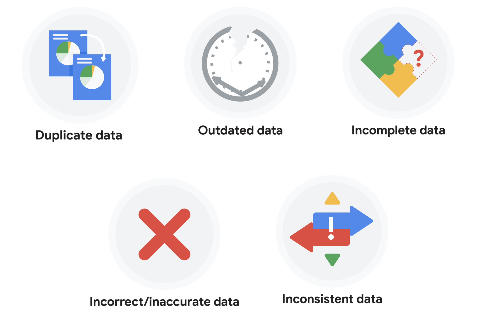
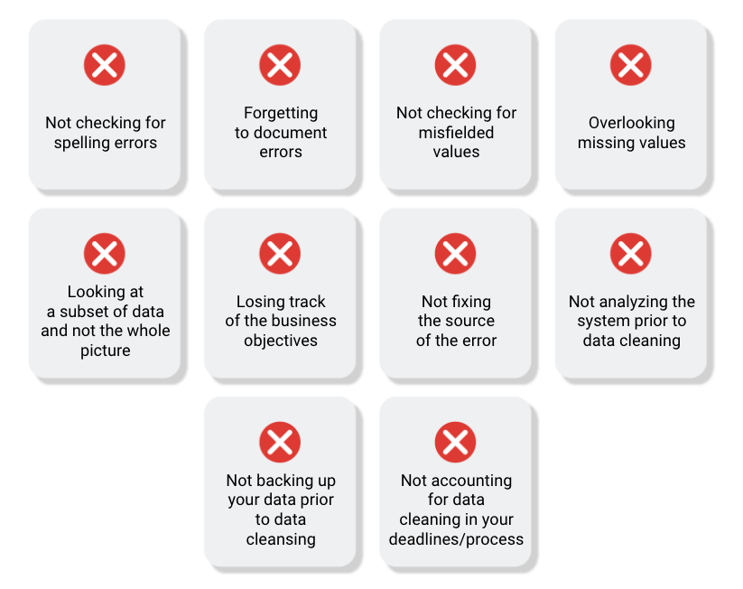

# What are the different steps of doing Data Analysis?
  

## Step 1: Ask  
It’s impossible to solve a problem if you don’t know what it is. These are some things to consider:

- Define the problem you’re trying to solve 
- Make sure you fully understand the stakeholder’s expectations
- Focus on the actual problem and avoid any distractions
- Collaborate with stakeholders and keep an open line of communication
- Take a step back and see the whole situation in context
- Questions to ask yourself in this step: 
- What are my stakeholders saying their problems are?
- Now that I’ve identified the issues, how can I help the stakeholders resolve their questions?

## Step 2: Prepare  
You will decide what data you need to collect in order to answer your questions and how to organize it so that it is useful. You might use your business task to decide: 

- What metrics to measure
- Locate data in your database
- Create security measures to protect that data
- Questions to ask yourself in this step: 
- What do I need to figure out how to solve this problem?
- What research do I need to do?

## Step 3: Process  
Clean data is the best data and you will need to clean up your data to get rid of any possible errors, inaccuracies, or inconsistencies. This might mean:

- Using spreadsheet functions to find incorrectly entered data 
- Using SQL functions to check for extra spaces
- Removing repeated entries
- Checking as much as possible for bias in the data
- Questions to ask yourself in this step: 
- What data errors or inaccuracies might get in my way of getting the best possible answer to the problem I am trying to solve?
- How can I clean my data so the information I have is more consistent?

## Step 4: Analyze   
You will want to think analytically about your data. At this stage, you might sort and format your data to make it easier to: 

- Perform calculations
- Combine data from multiple sources
- Create tables with your results
- Questions to ask yourself in this step:
- What story is my data telling me?
- How will my data help me solve this problem?
- Who needs my company’s product or service? What type of person is most likely to use it?

## Step 5: Share  
Everyone shares their results differently so be sure to summarize your results with clear and enticing visuals of your analysis using data viz tools like graphs or dashboards. This is your chance to show the stakeholders you have solved their problem and how you got there. Sharing will certainly help your team:  

- Make better decisions
- Make more informed decisions
- Lead to stronger outcomes
- Successfully communicate your findings
- Questions to ask yourself in this step:
- How can I make what I present to the stakeholders engaging and easy to understand?
- What would help me understand this if I were the listener?

## Step 6: Act  
Now it’s time to act on your data. You will take everything you have learned from your data analysis and put it to use. This could mean providing your stakeholders with recommendations based on your findings so they can make data-driven decisions.

Questions to ask yourself in this step:
How can I use the feedback I received during the share phase (step 5) to actually meet the stakeholder’s needs and expectations?
These six steps can help you to break the data analysis process into smaller, manageable parts, which is called structured thinking. This process involves four basic activities:

- Recognizing the current problem or situation
- Organizing available information 
- Revealing gaps and opportunities
- Identifying your options

# Cheat Sheets
1. [R](https://www.rstudio.com/resources/cheatsheets/)  
2. [SQL](https://www.sqltutorial.org/sql-cheat-sheet/)  

# What is the difference between different Data Analysis Roles?

# What are the different types of problems data analysis solve?
## Making predictions 
A company that wants to know the best advertising method to bring in new customers is an example of a problem requiring analysts to make predictions. Analysts with data on location, type of media, and number of new customers acquired as a result of past ads can't guarantee future results, but they can help predict the best placement of advertising to reach the target audience.

## Categorizing things 
An example of a problem requiring analysts to categorize things is a company's goal to improve customer satisfaction. Analysts might classify customer service calls based on certain keywords or scores. This could help identify top-performing customer service representatives or help correlate certain actions taken with higher customer satisfaction scores.

## Spotting something unusual 
A company that sells smart watches that help people monitor their health would be interested in designing their software to spot something unusual. Analysts who have analyzed aggregated health data can help product developers determine the right algorithms to spot and set off alarms when certain data doesn't trend normally.

## Identifying themes 
User experience (UX) designers might rely on analysts to analyze user interaction data. Similar to problems that require analysts to categorize things, usability improvement projects might require analysts to identify themes to help prioritize the right product features for improvement. Themes are most often used to help researchers explore certain aspects of data. In a user study, user beliefs, practices, and needs are examples of themes. 

By now you might be wondering if there is a difference between categorizing things and identifying themes, The best way to think about it is this: Categorizing things involves assigning items to categories. Identifying themes takes those categories a step further by grouping them into broader themes.

## Discovering connections 
A third-party logistics company working with another company to get shipments delivered to customers on time is a problem requiring analysts to discover connections. By analyzing the wait times at shipping hubs, analysts can determine the appropriate schedule changes to increase the number of on-time deliveries. 

## Finding patterns
Minimizing downtime caused by machine failure is an example of a problem requiring analysts to find patterns in data. For example, by analyzing maintenance data, they might discover that most failures happen if regular maintenance is delayed by more than a 15-day window. 

# How to ask SMART questions?

# How to gather data for doing analysis?

# Data Modelling Comparison
[Data Modelling](https://www.1keydata.com/datawarehousing/data-modeling-levels.html)

# What is the difference between structured and unstructured data?

# How to transform data?
Data transformation usually involves:

- Adding, copying, or replicating data 
- Deleting fields or records 
- Standardizing the names of variables
- Renaming, moving, or combining columns in a database
- Joining one set of data with another
- Saving a file in a different format. For example, saving a spreadsheet as a comma separated values (CSV) file.

# How to handle data issues?

# How to calculate sample size for the data analysis?
[Sample Size Calculator](https://www.surveymonkey.com/mp/sample-size-calculator/)

# What is dirty data?

# What are the common pitfalls in cleaning the dirty data?

# Data Cleaning Checklist
- Sources of errors: Did you use the right tools and functions to find the source of the errors in your dataset?
- Null data: Did you search for NULLs using conditional formatting and filters?
- Misspelled words: Did you locate all misspellings?
- Mistyped numbers: Did you double-check that your numeric data has been entered correctly?
- Extra spaces and characters: Did you remove any extra spaces or characters using the TRIM function?
- Duplicates: Did you remove duplicates in spreadsheets using the Remove Duplicates function or DISTINCT in SQL?
- Mismatched data types: Did you check that numeric, date, and string data are typecast correctly?
- Messy (inconsistent) strings: Did you make sure that all of your strings are consistent and meaningful?
- Messy (inconsistent) date formats: Did you format the dates consistently throughout your dataset?
- Misleading variable labels (columns): Did you name your columns meaningfully?
- Truncated data: Did you check for truncated or missing data that needs correction?
- Business Logic: Did you check that the data makes sense given your knowledge of the business? 

# ‘The McCandless Method’ of Data Presentation

# How to select best chart type?
[Chart Type Selection](https://www.data-to-viz.com/)

# Data Viz Inspirations
- [Beautiful News](https://informationisbeautiful.net/beautifulnews/)  
- [Information is beautiful](https://informationisbeautiful.net/)  
- [Viz Catalogue](https://datavizcatalogue.com/#google_vignette)  
- [25 Best Viz](https://visme.co/blog/best-data-visualizations/)  
- [10 Data Viz Blogs](https://www.tableau.com/learn/articles/best-data-visualization-blogs)  
